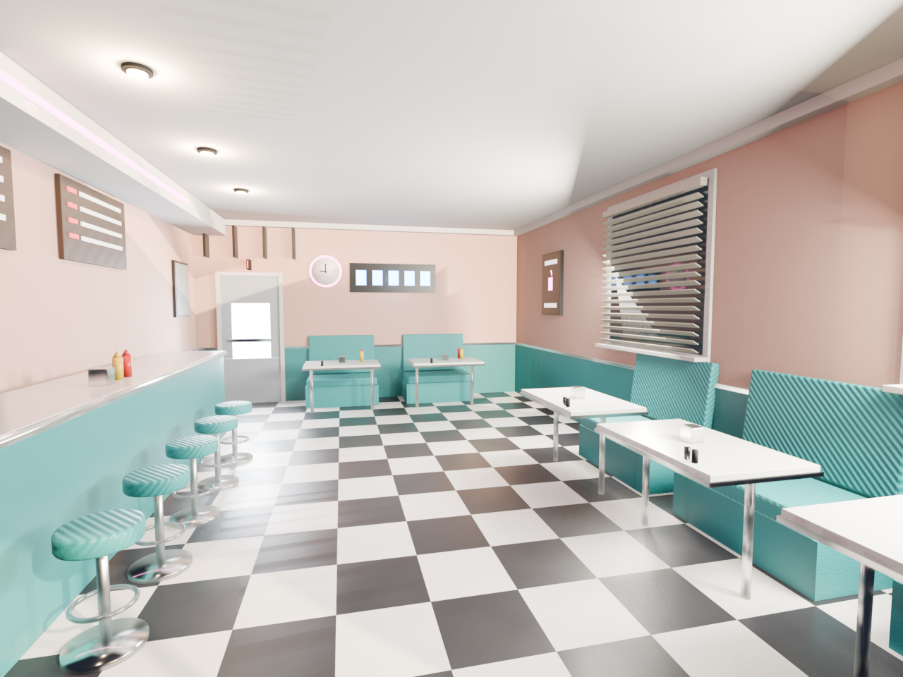
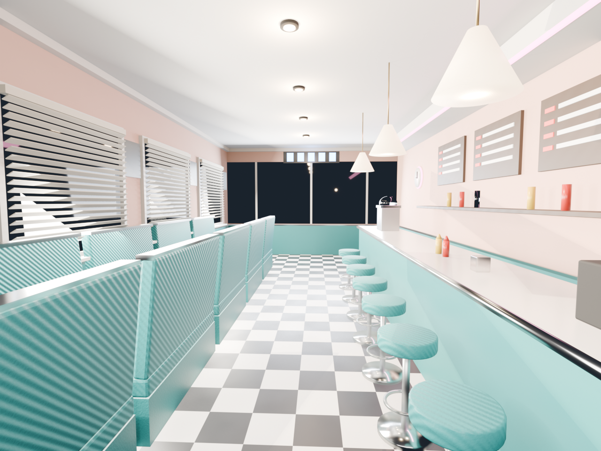
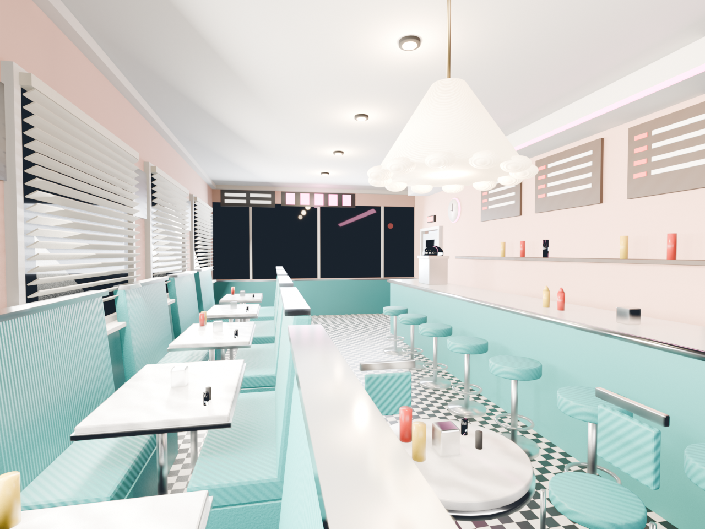

# Solidify

**A photo goes in. An editable 3D scene comes out. The model corrects its own work along the way.**

Solidify hands GLM-5.3-Flash a photograph of an interior. The model writes a Blender
script, renders the scene, then looks at its own render side by side with the original
photo, works out what doesn't match, and rewrites the script. Every round lands closer
to the reference.

Built with GLM-5.3-Flash.

| Photo | Round 1 | Round 2 | Round 3 |
|---|---|---|---|
|  |  |  |  |

## The loop

1. **Describe** — the model reads the photo and writes a full spatial spec: room
   dimensions in meters, wall and floor materials, every object's position and size,
   light sources and direction
2. **Build** — it writes a Blender Python script from that spec
3. **Render** — the script runs headless, producing an image and a `.blend`
4. **Compare** — the render and the photo go back to the model together
5. **Revise** — it rewrites the script to close the gap

## What it caught

Round 1, unprompted:

> The layout is mirrored — the camera is looking from the wrong end. Rotate the camera
> 180° or mirror the floor plan so the booths sit under the windows on the left and the
> counter runs along the right.

Round 2, after fixing that:

> Real photo: camera is off-axis, two-point perspective. Reconstruction: camera is
> dead-center in the aisle, one-point perspective. Move the camera to the left side near
> the front window and rotate it diagonally.

It measured its own floor tiles as 2–3× too large, diagnosed its booths as banquette
seating rather than facing pairs, and named the perspective structure of its own render
before prescribing the fix.

## Round by round

Each pass works at a finer grain than the last.

**Round 1** gets the elements right — pink walls, teal upholstery, checkerboard floor,
chrome-base stools, window blinds — but the floor plan is mirrored and the booths float
loose in the room.

**Round 2** fixes the structure. The camera flips to look down the length of the diner,
the way the photo does. Booths move against the window wall; the counter and stools take
the right side.

**Round 3** fills in the detail: tables attached to every booth, condiment bottles,
menu boards above the counter, the ceiling pendant, the wall clock. The composition now
reads as the same space as the photograph.

More rounds, more resolution — the loop keeps having somewhere to go.

## Why GLM-5.3-Flash

Natively multimodal, so it reads a render the way it reads a photo — no captioning layer
in between losing the spatial detail that decides whether a reconstruction is right.

And the economics are what make the loop viable at all. Everything in this project —
every trial, every dead end, every scene generation, render, critique and rewrite from
the first test to the final diner — cost **$0.43 total**. Iteration stops being something
you ration.

## Output

A `.blend` file with named, editable geometry — not an image. Open `diner_03.blend` in
Blender and walk around it.

## Run it

```
pip install openai
export ZAI_API_KEY=your-key
```

Requires Blender 5.2. Set `BLENDER` in cell 1 to your install path, then run
`photo-3d.ipynb`.

## Files

- `photo-3d.ipynb` — the pipeline
- `Reference.png` — source photo
- `results/diner_01.png`, `diner_02.png`, `diner_03.png` — renders per round
- `results/diner_0N_critique.txt` — the model's assessment of its own work each round
- `results/diner_description.txt` — the spatial spec it wrote from the photo
- `results/diner_03.blend` — final editable scene
