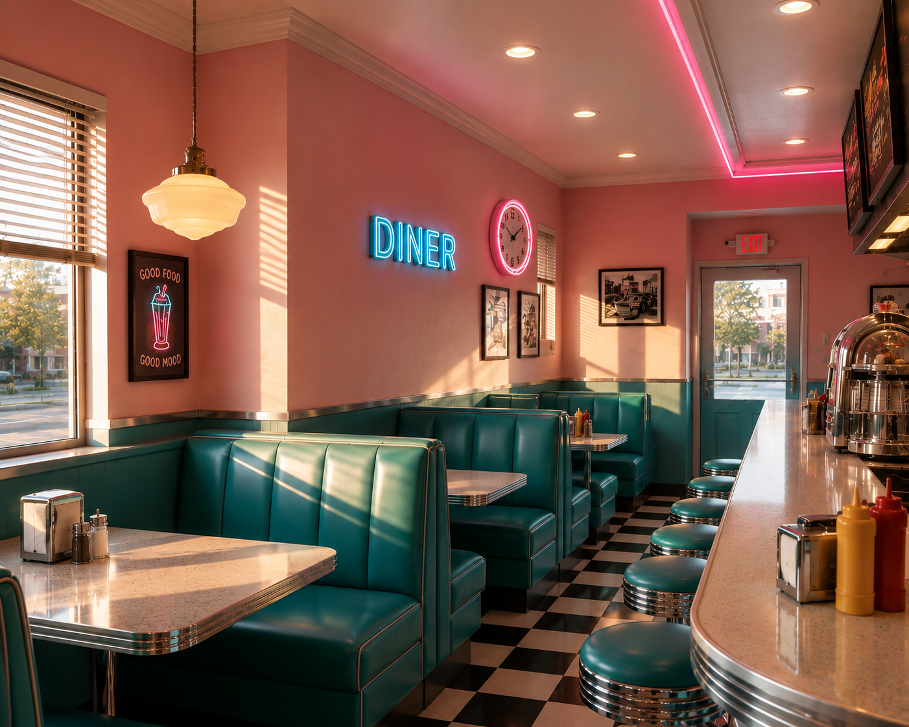

# Solidify

**A photo goes in. An editable 3D scene comes out — and the model corrects its own work along the way.**

Solidify hands GLM-5.3-Flash a photograph of an interior. The model writes a Blender
script, renders the scene, then looks at its own render side by side with the original
photo, works out what doesn't match, and rewrites the script. Round after round, the
render moves toward the reference.

Built with GLM-5.3-Flash for the Lightning Hackathon.

| Photo | Round 1 | Round 2 | Round 3 |
|---|---|---|---|
|  |  |  |  |

## The loop

1. **Describe** — the model reads the photo and writes a full spatial spec: room
   dimensions in meters, wall and floor materials, every object's position and size,
   light sources and direction
2. **Build** — it writes a Blender Python script from that spec
3. **Render** — the script runs headless, producing an image and a `.blend`
4. **Compare** — the render and the photo go back to the model together
5. **Revise** — it rewrites the script to close the gap

## What it caught

Round 1, unprompted:

> The layout is mirrored — the camera is looking from the wrong end. Rotate the camera
> 180° or mirror the floor plan so the booths sit under the windows on the left and the
> counter runs along the right.

Round 2, after fixing that:

> Real photo: camera is off-axis, two-point perspective. Reconstruction: camera is
> dead-center in the aisle, one-point perspective. Move the camera to the left side near
> the front window and rotate it diagonally.

It measured its own floor tiles as 2–3× too large, diagnosed its booths as banquette
seating rather than facing pairs, and named the perspective structure of its own render
before prescribing the fix.

By round 3 the camera matches the photo's composition, the booths run under the windows,
the counter and stools line the right wall, and the detail fills in — tables, condiments,
wall menus, the ceiling pendant.

## Why GLM-5.3-Flash

Natively multimodal, so it reads a render the way it reads a photo — no captioning layer
in between losing the spatial detail that decides whether a reconstruction is right. And
cheap enough that running the full loop costs pennies, which is what turns iteration from
a nice idea into the default.

## Output

A `.blend` file with named, editable geometry — not an image. Open `diner_03.blend` in
Blender and walk around it.

## Run it

```
pip install openai
export ZAI_API_KEY=your-key
```

Requires Blender 5.2. Set `BLENDER` in cell 1 to your install path, then run
`photo-3d.ipynb`.

## Files

- `photo-3d.ipynb` — the pipeline
- `Diner.png` — source photo
- `diner_01.png`, `diner_02.png`, `diner_03.png` — renders per round
- `diner_0N_critique.txt` — the model's assessment of its own work each round
- `diner_description.txt` — the spatial spec it wrote from the photo
- `diner_03.blend` — final editable scene
